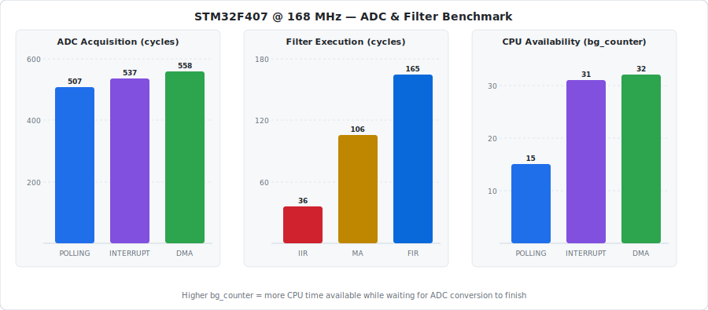

# STM32 ADC Acquisition Methods and Filters Benchmark

A bare-metal CMSIS benchmark on the STM32F407VG-DISC1 that compares three ADC acquisition methods and three digital filters using DWT cycle counters. Results are streamed over UART at 115200 baud.

---

## Hardware

| Item | Detail |
|------|--------|
| Board | STM32F407VG-DISC1 |
| MCU | STM32F407VGT6 @ 168 MHz |
| ADC input | PA1 → ADC1 Channel 1 |
| UART output | PA2 → USART2 TX (115200 baud) |
| Framework | CMSIS (bare-metal, no HAL) |
| Build tool | PlatformIO |

> **UART note:** The on-board ST-Link on the DISC1 does **not** provide a UART bridge (unlike Nucleo boards). An external USB-UART adapter (CP2102 or FT232) is required. Connect STM32 PA2 → adapter RX and STM32 GND → adapter GND.

> **ADC input note:** A 10 kΩ potentiometer was used for testing. Connect the wiper to PA1, one end to the board's **3V3** pin, and the other end to GND. Do **not** use 5 V — the ADC input is 3.3 V tolerant only.

---

## Project Structure

```
include/
  board.h          chip include, pin definitions, clock constants (APB1 = 42 MHz)
  config.h         project-level constants (buffer size, filter params); includes board.h
  profiler.h       DWT cycle counter API
  uart_debug.h     USART2 print utilities
  adc_polling.h    polling-mode ADC API
  adc_interrupt.h  interrupt-mode ADC API
  adc_dma.h        DMA-mode ADC API
  filters.h        MovingAvgFilter / FirFilter structs + filter function signatures

src/
  main.c           benchmark loop: acquires, filters, and prints cycle counts over UART
  profiler.c       DWT init and start/stop helpers
  uart_debug.c     USART2 init, uart_print / uart_print_uint / uart_println
  adc_polling.c    ADC1 single-conversion, CPU polls CR2.EOC
  adc_interrupt.c  ADC1 with EOCIE; result captured in EOC ISR
  adc_dma.c        ADC1 with DMA2 Stream 0; result written directly to RAM
  filters.c        moving_avg_update, iir_update, fir_update implementations
```

---

## ADC Acquisition Methods

### Polling
The CPU starts a conversion and then continuously reads the `EOC` (End of Conversion) flag until it is set. Simple to implement but the CPU is fully occupied during the wait.

### Interrupt
The CPU starts a conversion and returns to the main loop. When the conversion finishes, the ADC fires an interrupt and the ISR captures the result. The CPU is free to do other work while waiting.

### DMA
The CPU starts a conversion and the DMA controller transfers the result directly from the ADC data register to a RAM variable — no CPU involvement at all. The DMA fires an interrupt on transfer complete.

---

## Digital Filters

All filters operate on 12-bit ADC samples (`uint16_t`, range 0–4095).

### Moving Average (MA)
Maintains a circular buffer of the last 8 samples and returns their arithmetic mean. Provides good smoothing with a simple implementation.

```
output = (x[n] + x[n-1] + ... + x[n-7]) / 8
```

### IIR (1st-order low-pass)
A single-pole recursive filter with α = 0.25. Extremely cheap to compute — only a multiply-and-shift.

```
output = (sample + 3 × prev) >> 2
```

### FIR (Hamming-windowed, 8-tap)
A symmetric FIR filter with Hamming-windowed coefficients `[4, 14, 39, 72, 72, 39, 14, 4]` (sum = 258). Provides linear phase response.

```
output = Σ (coeff[i] × x[n-i]) / 258
```

---

## Benchmark Results

Measured on hardware at 168 MHz system clock. Cycle counts are from the DWT cycle counter and are stable across runs.



### ADC Acquisition

| Method | Cycles | bg\_counter | Notes |
|--------|--------|-------------|-------|
| Polling | 507 | 15 | CPU busy-waits the entire conversion |
| Interrupt | 537 | 31 | CPU free during conversion; ISR overhead adds ~30 cycles |
| DMA | 558 | 32 | CPU free during conversion; DMA setup adds ~50 cycles |

`bg_counter` increments in the `while(!done)` loop and reflects how much work the CPU can do while waiting for the ADC. Polling leaves the CPU with almost no free time (bg=15); both Interrupt and DMA double that (bg=31).

### Filter Execution

| Filter | Cycles | Notes |
|--------|--------|-------|
| IIR | 36 | Fastest — one multiply and a shift |
| Moving Average | 106 | 8-element accumulation loop |
| FIR | ~165 | 8 multiplications + accumulation |

Each filter is benchmarked independently per ADC method with its own filter state, so results are not cross-contaminated.

### Sample UART Output

```
POLLING   result=365  cycles=507  bg=15
POLLING   ma=362      cycles=106
POLLING   iir=363     cycles=36
POLLING   fir=367     cycles=165
INTERRUPT result=370  cycles=537  bg=31
INTERRUPT ma=360      cycles=106
INTERRUPT iir=361     cycles=36
INTERRUPT fir=364     cycles=162
DMA       result=355  cycles=558  bg=32
DMA       ma=357      cycles=106
DMA       iir=354     cycles=22
DMA       fir=356     cycles=167
```

---

## Build and Flash

Prerequisites: [PlatformIO](https://platformio.org/) with the `ststm32` platform installed.

```bash
# Build
pio run

# Flash via ST-Link
pio run --target upload

# Open serial monitor (115200 baud)
pio device monitor --baud 115200
```

---

## Clock Configuration

```
HSI (16 MHz) → PLL → SYSCLK 168 MHz
  AHB  ÷1  → 168 MHz  (CPU, DMA, DWT)
  APB1 ÷4  →  42 MHz  (USART2)
  APB2 ÷2  →  84 MHz  (ADC1)
```

Flash latency is set to 5 wait states before the PLL is enabled, as required at 168 MHz.
